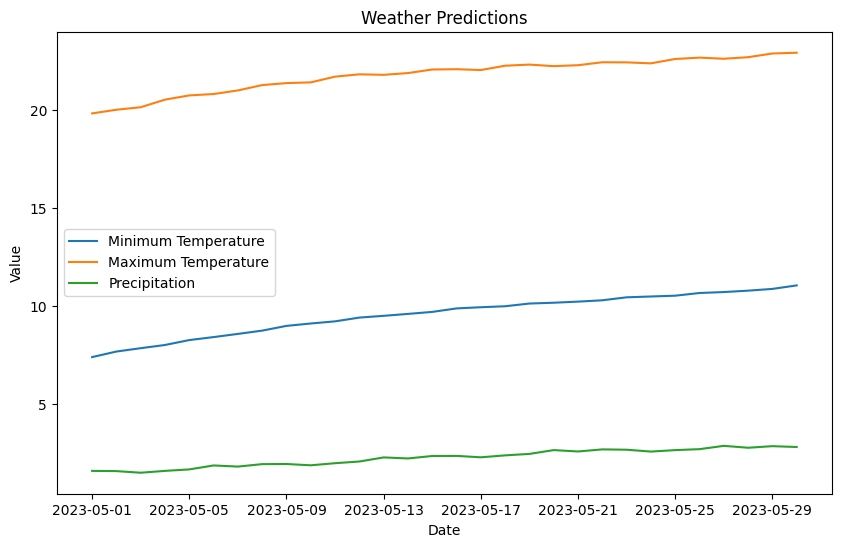

# Weather predictor

 
 

 

![Prophet](https://img.shields.io/badge/Prophet-3b5998?style=for-the-badge&logo=data:image/png;base64,iVBORw0KGgoAAAANSUhEUgAAAEAAAAA/CAYAAABQHc7KAAABhWlDQ1BJQ0MgcHJvZmlsZQAAKJF9kT1Iw0AcxV9bpUUqCnYQdchQnSziB+JYqlgEC6Wt0KqDyaVf0KQhSXFxFFwLDn4sVh1cnHV1cBUEwQ8QZwcnRRcp8X9JoUWMB8f9eHfvcfcO8DYqTDG6ooCimnoqHhOyuVXB/4oAhtGPSUyIzNAS6cUMXMfXPTx8vYvwLPdzf45eOW8wwCMQR5mmm8QbxLObpsZ5nzjESqJMfE48rtMFiR+5Ljn8xrlos5dnhvRMap44RCwUO1jqYFbSFeIZ4rCsqJTvzTosc97irFRqrHVP/sJgXl1Jc53mCOJYQgJJCJBQQxkVmIjQqpJiIEX7MRf/kO1PkksiVxmMHAuoQoFo+8H/4He3RmF6ykkKxoDuF8v6GAX8u0Czblnfx5bVPAF8z8CV2vZXG8DcJ+n1thY+Avq2gYvrtibtAZc7wOCTJuqiLfloegsF4P2MvikHDNwCPWtOb619nD4AGepq+QY4OATGipS97vLuQGdv/55p9fcDLRZy8er1pd4AAAAGYktHRAAAAAAAAPlDu38AAAAJcEhZcwAALiMAAC4jAXilP3YAAAAHdElNRQfoCBsRCjhOojFDAAAAGXRFWHRDb21tZW50AENyZWF0ZWQgd2l0aCBHSU1QV4EOFwAAA95JREFUaN7tm0toVVcUhv+dh0SJBhPSKuIDsYrWUrRSa8QHSECp6KTgY1DRQsFJC1IoVCg6EGlpQelMVBw5aB2oKKL4rigO0vpIrVYFRWtblKoxSY3m3s+BeyDpvWad3LtP7jk3P9zRWfes8/9rn73XWnsfqUwAfAK0Ao+B48B0lRH5tfwfHcBb5SLALXLjh4oyIF8taXSey+NTL4Bz7rmkK3kuXyyXV2AR0N1j+N8FGsppIvwA2A2cAbYAjRrAAAZQ9nAJnMzGS5oqqVLSDefc5XKZxacBp3Jkc63AwrSTbwY6yY8MsDat5N8AHtI7ngMz0ijAJuzYl0YBLkQQ4D+gKsr9k1AMjYpgWyOpMW0CtEW0f5w2Ac5GsP3VOdeZtjngfSBrnAPWpHUp/M5A/gBQ0d8PWgUMB+qKfF8HfA105SCeBbYDNbHWAsA0SfMlzZY0SdIEPwu/in8l3dTLltRpScecc7cL8DlO0nJJ70iqlnRN0k/OuUtxRbgeWA9co2/IAkf6Gq3+HNq1wGagncKxJmnkm4E7FAdbk0TcARt9pVUMHI2apvYn+UpgJ8XDDaA+SZHfVkTyT4CpSRr6XxZA9oHv0Fz1NXwGWJok8k2+sWBFh09CFgODc9yvIUnkq330rOv5LmCU0gLgMyP5LuDjtBUbg4xrfQZYHONzzYrL0XJj9DfE9Dw1fhluB4bF4fCggXxrHOUmMBZoiS11BoYATw0CLIuB/Fzg7x5+94R2usBA/p/Q0QfW5VmCHwHBtvAqJFmOix12zmUDvu+7JH0vKVetUCdpTEgBLEfFTgUM/g5Jq3qxmRJSgDcNdncDCvDMYNMYUoBag939gALcM9jUhRSg22A3KOT8Z7DJhhTAEt2RAQUYYbB5ElKABwa7MQEFGG2w+SukAJYJbk6oGkRSk8H0j5AJyExDItQJDA/gu9mYhAVNhFrU+w5si6SOAP4/t+QgzjkUEsD+10TgVohjpX7T04IVcVSDH75m6L8XwF8tcMVAvg0YEocADvg9R9trRQBfVcCPxuh/G2dX6NMezr8J4GMocMhIvg0YEacAFcBp7/wIUGn4T12E+38E3IzQcf5CcQOYCPxmaWcDy3xb/Biw2m9dv3p9MPAu8BXwS8T9hXP+Uxf1hwg1vVyv9DvFuY6ttAN/Gg825sN9YKxKEcAwYC/h0AE0lSr5yQUcjLDgITCvVMkv8V9chsJV4O1SJT8U+DkQ8Yzfia5VKcMnSiuB20UkfwKYqSTBrwBL/Jm87j6+5ztKiXghx+TqfS0/W9IM39lp8L+Mrx7vSbou6ZKkk5LOO+e6SimoLwBsC97rq9VxCgAAAABJRU5ErkJggg==&logoColor=ffffff)
 
![matplotlib](https://img.shields.io/badge/matplotlib-16567b?style=for-the-badge&logo=data:image/png;base64,iVBORw0KGgoAAAANSUhEUgAAAEAAAABACAYAAACqaXHeAAABhWlDQ1BJQ0MgcHJvZmlsZQAAKJF9kT1Iw0AcxV9bpUUqCnYQdchQnSziB+JYqlgEC6Wt0KqDyaVf0KQhSXFxFFwLDn4sVh1cnHV1cBUEwQ8QZwcnRRcp8X9JoUWMB8f9eHfvcfcO8DYqTDG6ooCimnoqHhOyuVXB/4oAhtGPSUyIzNAS6cUMXMfXPTx8vYvwLPdzf45eOW8wwCMQR5mmm8QbxLObpsZ5nzjESqJMfE48rtMFiR+5Ljn8xrlos5dnhvRMap44RCwUO1jqYFbSFeIZ4rCsqJTvzTosc97irFRqrHVP/sJgXl1Jc53mCOJYQgJJCJBQQxkVmIjQqpJiIEX7MRf/kO1PkksiVxmMHAuoQoFo+8H/4He3RmF6ykkKxoDuF8v6GAX8u0Czblnfx5bVPAF8z8CV2vZXG8DcJ+n1thY+Avq2gYvrtibtAZc7wOCTJuqiLfloegsF4P2MvikHDNwCPWtOb619nD4AGepq+QY4OATGipS97vLuQGdv/55p9fcDLRZy8er1pd4AAAAGYktHRAAAAAAAAPlDu38AAAAJcEhZcwAALiMAAC4jAXilP3YAAAAHdElNRQfoCBsRFDMNMdcUAAAAGXRFWHRDb21tZW50AENyZWF0ZWQgd2l0aCBHSU1QV4EOFwAABY1JREFUeNrlm0tPXVUUx//n6qi0QAdG6qDQqIWkaUM7UevEmUlNHOLIYGz8FJe0TVu/gTF1duuTpk60TXTWEQ4akXGhiQIFvGACMTCRx88Bm3q4nruf51xoukZw93P999rrtdfJ1AECXpA0IGlQ0gVJ/ZK6Jb1kuqxI+lvSrKRJSdOS/siybFvPKgHDwA1gEpgDloAN/qN6m783gD/NmF+B68C5Z4XpE4bpGWAZwNEfzz7LwLQBo+8wMn4K+B5YALYDxjkBaOm/bda4CwwcBsZ7gXEj3kSMJ2HcEvAN0HNQzF8Gfgf+SZgjCoDc+C1gHrjcScaPAT8BayFMFjGaCkBunjXgPnC0aubPAI+BTV+mOwGAmWvT7G2oKubfBp7EMB5BKwn7XAQuls38+8Cypb0Rwl07CfCVHI/9NoH3yjz5ptnLSOqph1wBYCUUCGAk5ztcLOPOL+Q8O4B6isjH6gAfIFr3aHyGoRRt/9ixQMcAcI0pOiDz+wzQFQPA/SJtnwqCLwDAsIc0NGzM56zDz6HMf2Kz87kFSZECBwB5miho72rpU7fsdxX4yJf5bmAu9E5WDIDVj/C5Ria67G39vVbQ95akE47JJlr+r2dZlsXeY1/T1zJmuNUUO5Z9RdJnPlHdkg8DRTqhBD9gxGdsgR7q8pSCRaDf1uEusBOqhWNBsClGX+Yjcgt3bMmMhdjoLRSEGABs2j4AhAXg5aKGG8CWr+inWodIAKza3nOPW8C1oobpMmL3FAA8Tp5QBdumz/Q+K2A0am+ABm840D9fYix2XtKUpDFJf7mY87RGPcDZVvHfiTlVi0YfjrUKNrEPUHa2mGFn3zUAJssS6zI9Rot7W0a2+eHTRwuX5xfr6/uCYFkjRdu72ueAmoDXbM5Pqr/vOUcjNBHiKQUTlvYl4FTNPFd1V5BCCwl1R2PXcHSxJUSOSRqsafet7kiFiVRy2tnHOoztaXIHg2OJW+uSdEHAFw6NWTbVfRVeGdfAwdfnL0o6XgKaIXTTcqKvl5Um96BfJB3PgAeS3tHzSQ9qes6ppt3ihLGsDZW41m3XfEVrZxZKaTdXoFmJEiwYP+yrDDutBGuS5mOPNHeiHzikZqrA1H1aFMDkPUMHc0lhsaF5AZeAjYTAoujkulymzicYSgx4XO3rwLsCXnW4wishohYZ+dVDQSjJFR7wDoZ8T8OSw7MGPzbwqgyGaqYUzfkcbXuyLrr3WZZlJtEylbcy7TbX4jI7mbFZFM/7v5Rl2c7egOs+CZHAXL9XAtPn0SMmUvRIiFzN/3DO9v7vi2po9tbnISSmXsADoCZwpuqkaD3Etwj1QxKl9dG+pKihcVta3McrbHmuullybO/d36EftiR9W9TQV9bDiEdfUq9B6GOr82HENCY/jbXbfEiGuY05jcpJFsw5buswACx63vMuH20fGE/Uq7IMZvwicNLV6WuPOsBGyHNVanq9DBDMk9iXPpuMKpAIUF6NlHK4WACBWe+6YuBjYNWm7VvWDC9CUnKxdAjzq8CHoYvc8yySaqQyUiUApkjqx5jTOeoqk0tlJnWMZ2Z5OlZCBQwB8zHavmwAfLJGbQolT6c+bLxlK5WNCXRCkxoJpbJvlJLNNFmjZll31RJBllUsvQxcKjV9bCThScL4iQCHaCJhnUXgzUpy6EYnzLgcpaqtQJu5No3CO60qySQ879n8hE4DYOz8D8ARdYqAUfPR1OZBAWBOfR4Y1UEQ0AN8Ze7dTgcdoR2z5m2gWwdNQD9wx9jdraoAMAHNAvCdM6o7ICD6gGtGGTVjcgttTrsJPAKutE1mHEIwzgJXgYe5j6fX29QF5f9eN31nzdgr/0tglkhZh8CoafeT+UHtlsmc1G5h5t5pNiWtSZqT9Jt2P5+ffZq3r5D+BT4rFy2wQZUsAAAAAElFTkSuQmCC&logoColor=ffffff)
 

Machine learning project using <a href="https://github.com/facebook/prophet">Prophet</a> and data regarding every day from 1966 to the present from <a href="https://danepubliczne.imgw.pl/">Instytut Meteorologii i Gospodarki Wodnej</a> to predict future weather conditions in Tarnów (Lesser Poland, PL). The project does not provide any useful information, as the weather is a very unstable and unpredictable factor. Consider this as an educational project only.

 

## Used data

<a href="https://danepubliczne.imgw.pl/data/dane_pomiarowo_obserwacyjne/dane_meteorologiczne/dobowe/synop/">Historical weather data from IMGW website</a>

## Used frameworks and libraries

• <a href="https://jupyter.org/">Jupyter Notebook</a>

• <a href="https://facebook.github.io/prophet/">Prophet</a>

• <a href="https://joblib.readthedocs.io/en/latest/">Joblib</a>

• <a href="https://pandas.pydata.org/">Pandas</a>

• <a href="https://matplotlib.org/">Matplotlib</a>

## Notebooks

• <strong>Collecting weather data</strong> - downloads data files from IMGW website, concatenates them and prepares data for training

• <strong>Training and saving models</strong> - uses  collected data to train models for predicting minimum temperature,  maximum temperature and precipitation, then saves them into models/ folder

• <strong>Making predictions</strong> - loads pre-trained models to make predictions and draw plots for 30 days in the future

## Python versions

Main branch: <strong>3.12.4</strong>

Colab branch: <strong>3.10.12</strong>

